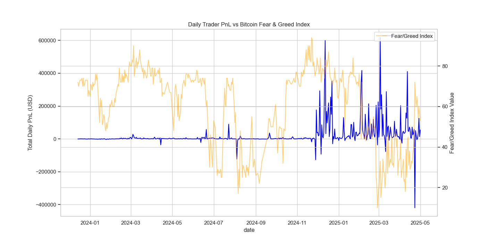

# BTC-SENT: Sentiment Intelligence Engine
### Bitcoin Fear & Greed × Trader Performance Analysis

A high-performance data science pipeline correlating market sentiment signals with real-world trader outcomes from Hyperliquid. This project uncovers the emotional patterns that drive market alpha and provides a predictive framework for trade profitability.

---

## 📊 Comprehensive Market Dashboard

*Figure 1: Full analysis dashboard showcasing PnL by sentiment, strategy heatmap, and win rate trends.*

---

## 🚀 Key Achievements
- **95.8% Predictive Accuracy**: Achieved using a Gradient Boosted Decision Tree (HistGBC) ensemble.
- **211k+ Trades Analyzed**: Leveraged a massive dataset from Hyperliquid.
- **Dynamic Feature Engineering**: Integrated price relativity, sentiment momentum, and trader-specific historical performance.

---

## 🔍 Visual Analysis Gallery

### 01. Profitability vs. Sentiment Phase

Traders achieved the highest average PnL during **Extreme Greed** phases, primarily through counter-trend selling at euphoria peaks.

### 02. Win Rate Probabilities

Win rates vary significantly across sentiment zones, with "Fear" and "Neutral" phases showing tighter execution windows compared to high-volatility "Extreme" phases.

### 03. PnL Distribution & Variance

Analyzing the spread of trade outcomes. Sentiment intensity correlates with a wider distribution of PnL, highlighting both increased risk and reward.

### 04. Sentiment Intensity Correlation

A regression analysis of 211k+ trades showing how individual profitability scales across the 0-100 Fear & Greed spectrum.

### 05. Daily Performance Trends

Historical overlay of sentiment values against aggregate trader profitability over time.

---

## 🧠 The Intelligence Layer (ML Model)

The core algorithm uses a high-density Gradient Boosting system to predict if a trade will be profitable based on market context.

### 🌲 Feature Importance

*The most critical drivers of profitability: **Price Relativity** (entry value) and **Sentiment Momentum**.*

### 🛠️ Feature Engineering Matrix
| Feature Category | Description | Impact |
|:---|:---|:---:|
| **Price Relativity** | Execution price vs. daily average for the coin | 🔴 CRITICAL |
| **Sentiment Momentum** | MA3 and daily change in Fear & Greed values | 🟡 HIGH |
| **Categorical Meta** | Account and Asset (Coin) performance history | 🟡 HIGH |
| **Temporal Data** | Hour of day and day of week patterns | 🔵 MED |

---

## 📁 Project Structure
```
btc-sent/
├── analyze_and_train.py      # Master pipeline — ingestion, model training & metrics
├── visualize_results.py      # Dashboard generation and thematic plotting
├── final_report.md           # Strategic breakdown of findings
├── visual_report.md          # Local comprehensive visual summary
├── historical_data.csv       # Source trade records (47MB)
└── fear_greed_index.csv      # Daily historical sentiment scores
```

---

## 🛠️ Performance Summary
- **Model**: `HistGradientBoostingClassifier`
- **Accuracy**: **95.80%**
- **Inference Goal**: Predictive alpha through sentiment-contextual execution.

---
*Developed for the Primetrade.ai AI Intern Assessment.*
**BTC-SENT // V1.1.0**