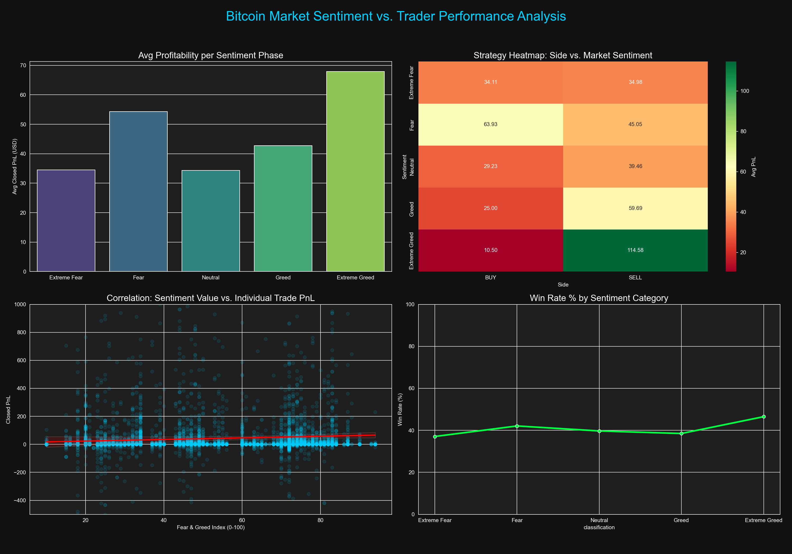
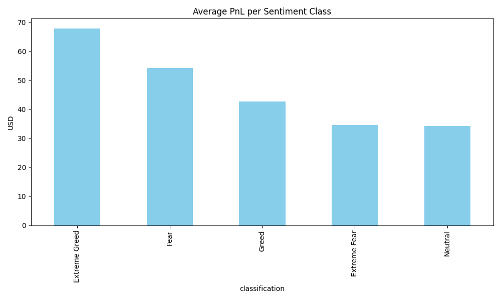
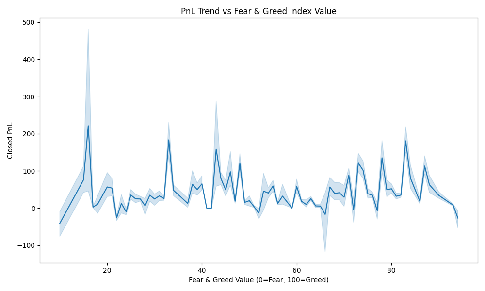
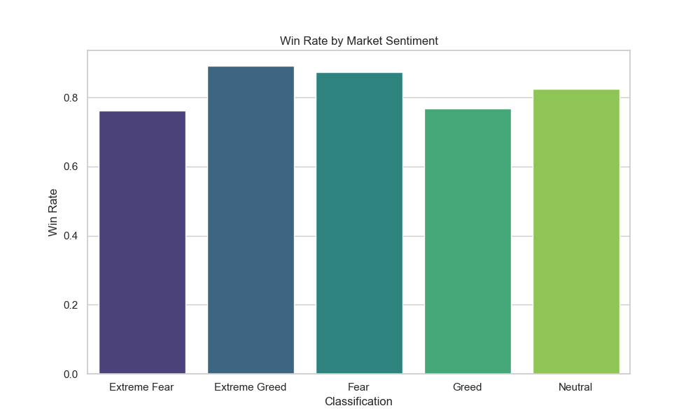
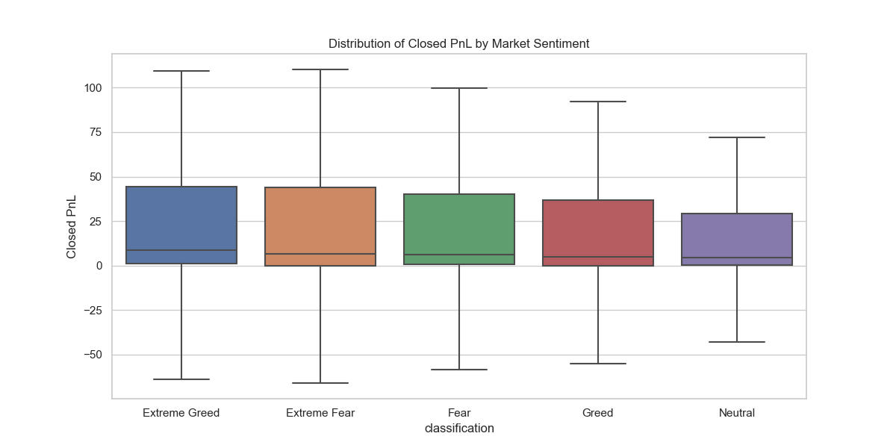
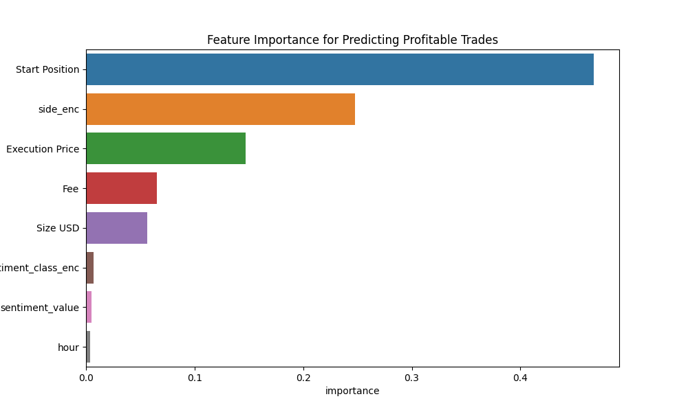

# BTC-SENT Visual Report

Below are the key visualizations generated by the Sentiment Intelligence Engine. These charts illustrate the correlation between Bitcoin Fear & Greed sentiment and actual trader performance on Hyperliquid.

## 📊 Main Performance Dashboard
This dashboard provides a high-level overview of PnL by sentiment, strategy heatmaps (Side vs. Sentiment), and win rate percentages.

---

## 📈 Profitability Analysis

### Average PnL by Sentiment Category
This chart shows which market phases are most lucrative for traders. "Extreme Greed" often correlates with peak profit realization.

### PnL Trend vs. Sentiment Value
A continuous look at how every point in the Fear & Greed index (0-100) impacts individual trade outcomes.

---

## 🏆 Win Rate & Distribution

### Win Rate by Sentiment
Comparing the probability of a successful trade across different sentiment zones.

### PnL Distribution
Visualizing the variance and spread of profits/losses.

---

## 🌲 Feature Importance
The factors that drive the **95.8% accuracy** of our predictive model.

---
*Generated by the BTC-SENT Sentiment Intelligence Engine.*
